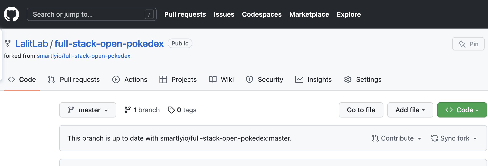
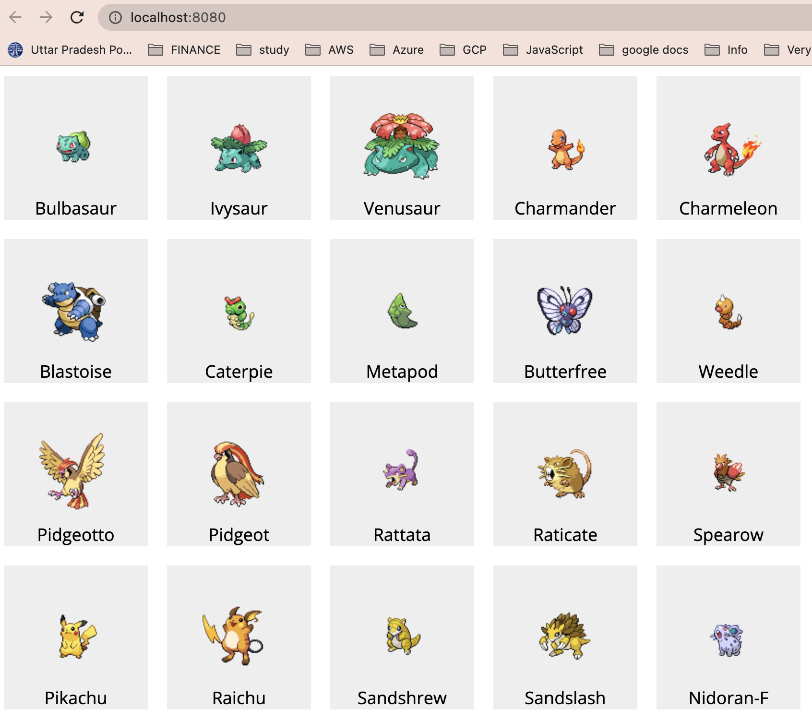
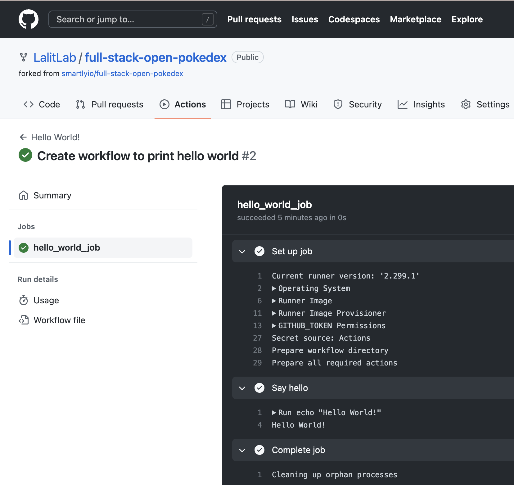
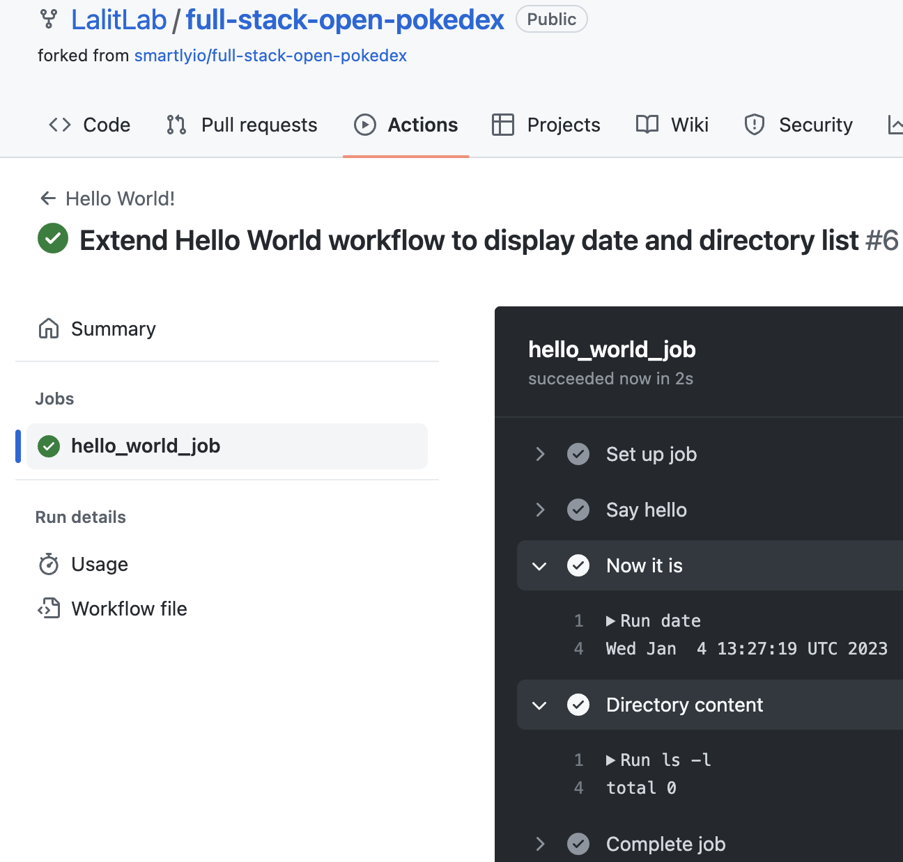

# Getting Started With GitHub Actions

1. Follow instructions: [Introduction to CI/CD](https://fullstackopen.com/en/part11/introduction_to_ci_cd)
2. Complete exercises: [Getting started with GitHub Actions](https://fullstackopen.com/en/part11/getting_started_with_git_hub_actions)

## Exercises

### Exercise 11.2 - Fork the repo and try on system

#### Fork the example repository:

First I forked the example repository [smartlyio/full-stack-open-pokedex](https://github.com/smartlyio/full-stack-open-pokedex) to my Github account as [LalitLab/full-stack-open-pokedex](https://github.com/LalitLab/full-stack-open-pokedex)

    

#### Try the project locally on system

1.  Then cloned the repository to my system to implement the exercises locally.

    <details>
      <summary> clone the repo locally</summary>

    ```sh
    $ git clone git@github.com:LalitLab/full-stack-open-pokedex.git
    Cloning into 'full-stack-open-pokedex'...
    remote: Enumerating objects: 138, done.
    remote: Total 138 (delta 0), reused 0 (delta 0), pack-reused 138
    Receiving objects: 100% (138/138), 150.74 KiB | 290.00 KiB/s, done.
    Resolving deltas: 100% (57/57), done.
    ```

    </details>

2.  Run `npm install` locally to install project dependencies

    <details>
      <summary> install dependencies</summary>

    ```sh
    $ full-stack-open-pokedex git:(master) npm install
    npm WARN old lockfile
    npm WARN old lockfile The package-lock.json file was created with an old version of npm,
    npm WARN old lockfile so supplemental metadata must be fetched from the registry.
    npm WARN old lockfile
    npm WARN old lockfile This is a one-time fix-up, please be patient...
    npm WARN old lockfile
    npm WARN deprecated fsevents@1.2.12: fsevents 1 will break on node v14+ and could be using insecure binaries. Upgrade to fsevents 2.
    npm WARN deprecated ini@1.3.5: Please update to ini >=1.3.6 to avoid a prototype pollution issue
    npm WARN deprecated request-promise-native@1.0.8: request-promise-native has been deprecated because it extends the now deprecated request package, see https://github.com/request/request/issues/3142
    npm WARN deprecated urix@0.1.0: Please see https://github.com/lydell/urix#deprecated
    npm WARN deprecated har-validator@5.1.3: this library is no longer supported
    npm WARN deprecated fsevents@2.1.3: "Please update to latest v2.3 or v2.2"
    npm WARN deprecated resolve-url@0.2.1: https://github.com/lydell/resolve-url#deprecated
    npm WARN deprecated source-map-resolve@0.5.3: See https://github.com/lydell/source-map-resolve#deprecated
    npm WARN deprecated w3c-hr-time@1.0.2: Use your platform's native performance.now() and performance.timeOrigin.
    npm WARN deprecated source-map-url@0.4.0: See https://github.com/lydell/source-map-url#deprecated
    npm WARN deprecated sane@4.1.0: some dependency vulnerabilities fixed, support for node < 10 dropped, and newer ECMAScript syntax/features added
    npm WARN deprecated mini-create-react-context@0.4.0: Package no longer supported. Contact Support at https://www.npmjs.com/support for more info.
    npm WARN deprecated debug@3.2.6: Debug versions >=3.2.0 <3.2.7 || >=4 <4.3.1 have a low-severity ReDos regression when used in a Node.js environment. It is recommended you upgrade to 3.2.7 or 4.3.1. (https://github.com/visionmedia/debug/issues/797)
    npm WARN deprecated debug@3.2.6: Debug versions >=3.2.0 <3.2.7 || >=4 <4.3.1 have a low-severity ReDos regression when used in a Node.js environment. It is recommended you upgrade to 3.2.7 or 4.3.1. (https://github.com/visionmedia/debug/issues/797)
    npm WARN deprecated debug@3.2.6: Debug versions >=3.2.0 <3.2.7 || >=4 <4.3.1 have a low-severity ReDos regression when used in a Node.js environment. It is recommended you upgrade to 3.2.7 or 4.3.1. (https://github.com/visionmedia/debug/issues/797)
    npm WARN deprecated chokidar@2.1.8: Chokidar 2 does not receive security updates since 2019. Upgrade to chokidar 3 with 15x fewer dependencies
    npm WARN deprecated debug@4.1.1: Debug versions >=3.2.0 <3.2.7 || >=4 <4.3.1 have a low-severity ReDos regression when used in a Node.js environment. It is recommended you upgrade to 3.2.7 or 4.3.1. (https://github.com/visionmedia/debug/issues/797)
    npm WARN deprecated debug@4.1.1: Debug versions >=3.2.0 <3.2.7 || >=4 <4.3.1 have a low-severity ReDos regression when used in a Node.js environment. It is recommended you upgrade to 3.2.7 or 4.3.1. (https://github.com/visionmedia/debug/issues/797)
    npm WARN deprecated debug@4.1.1: Debug versions >=3.2.0 <3.2.7 || >=4 <4.3.1 have a low-severity ReDos regression when used in a Node.js environment. It is recommended you upgrade to 3.2.7 or 4.3.1. (https://github.com/visionmedia/debug/issues/797)
    npm WARN deprecated debug@4.1.1: Debug versions >=3.2.0 <3.2.7 || >=4 <4.3.1 have a low-severity ReDos regression when used in a Node.js environment. It is recommended you upgrade to 3.2.7 or 4.3.1. (https://github.com/visionmedia/debug/issues/797)
    npm WARN deprecated debug@4.1.1: Debug versions >=3.2.0 <3.2.7 || >=4 <4.3.1 have a low-severity ReDos regression when used in a Node.js environment. It is recommended you upgrade to 3.2.7 or 4.3.1. (https://github.com/visionmedia/debug/issues/797)
    npm WARN deprecated debug@4.1.1: Debug versions >=3.2.0 <3.2.7 || >=4 <4.3.1 have a low-severity ReDos regression when used in a Node.js environment. It is recommended you upgrade to 3.2.7 or 4.3.1. (https://github.com/visionmedia/debug/issues/797)
    npm WARN deprecated debug@4.1.1: Debug versions >=3.2.0 <3.2.7 || >=4 <4.3.1 have a low-severity ReDos regression when used in a Node.js environment. It is recommended you upgrade to 3.2.7 or 4.3.1. (https://github.com/visionmedia/debug/issues/797)
    npm WARN deprecated debug@4.1.1: Debug versions >=3.2.0 <3.2.7 || >=4 <4.3.1 have a low-severity ReDos regression when used in a Node.js environment. It is recommended you upgrade to 3.2.7 or 4.3.1. (https://github.com/visionmedia/debug/issues/797)
    npm WARN deprecated querystring@0.2.0: The querystring API is considered Legacy. new code should use the URLSearchParams API instead.
    npm WARN deprecated uuid@3.4.0: Please upgrade  to version 7 or higher.  Older versions may use Math.random() in certain circumstances, which is known to be problematic.  See https://v8.dev/blog/math-random for details.
    npm WARN deprecated request@2.88.2: request has been deprecated, see https://github.com/request/request/issues/3142
    npm WARN deprecated axios@0.19.2: Critical security vulnerability fixed in v0.21.1. For more information, see https://github.com/axios/axios/pull/3410
    npm WARN deprecated core-js-pure@3.6.5: core-js-pure@<3.23.3 is no longer maintained and not recommended for usage due to the number of issues. Because of the V8 engine whims, feature detection in old core-js versions could cause a slowdown up to 100x even if nothing is polyfilled. Some versions have web compatibility issues. Please, upgrade your dependencies to the actual version of core-js-pure.

    added 1353 packages, and audited 1354 packages in 17s

    49 packages are looking for funding
      run `npm fund` for details

    54 vulnerabilities (1 low, 20 moderate, 26 high, 7 critical)

    To address issues that do not require attention, run:
      npm audit fix

    To address all issues (including breaking changes), run:
      npm audit fix --force

    Run `npm audit` for details.
    ```

    </details>

3.  Start the code in development mode

    <details>
      <summary>app started in development mode</summary>

    ```sh
    full-stack-open-pokedex git:(master) ✗ npm run start

    > fullstackopen-cicd@1.0.0 start
    > webpack-dev-server --open --mode development

    (node:3949) [DEP0111] DeprecationWarning: Access to process.binding('http_parser') is deprecated.
    (Use `node --trace-deprecation ...` to show where the warning was created)
    ℹ ｢wds｣: Project is running at http://localhost:8080/
    ℹ ｢wds｣: webpack output is served from /
    ℹ ｢wds｣: Content not from webpack is served from /Users/lalitbhardwaj/Learning/gh_actions/full-stack-open-pokedex
    ℹ ｢wds｣: 404s will fallback to /index.html
    ℹ ｢wdm｣: wait until bundle finished: /
    Browserslist: caniuse-lite is outdated. Please run:
    npx browserslist@latest --update-db
    ℹ ｢wdm｣: Hash: b974bb4c6cae71a68a45
    Version: webpack 4.43.0
    Time: 766ms
    Built at: 01/04/2023 5:36:43 PM
          Asset       Size  Chunks             Chunk Names
    ./index.html  261 bytes          [emitted]
      bundle.js   1.54 MiB    main  [emitted]  main
    Entrypoint main = bundle.js
    [0] multi (webpack)-dev-server/client?http://localhost:8080 ./src/index.jsx 40 bytes {main} [built]
    [./node_modules/react-dom/index.js] 1.33 KiB {main} [built]
    [./node_modules/react/index.js] 190 bytes {main} [built]
    [./node_modules/webpack-dev-server/client/index.js?http://localhost:8080] (webpack)-dev-server/client?http://localhost:8080 4.29 KiB {main} [built]
    [./node_modules/webpack-dev-server/client/overlay.js] (webpack)-dev-server/client/overlay.js 3.51 KiB {main} [built]
    [./node_modules/webpack-dev-server/client/socket.js] (webpack)-dev-server/client/socket.js 1.53 KiB {main} [built]
    [./node_modules/webpack-dev-server/client/utils/createSocketUrl.js] (webpack)-dev-server/client/utils/createSocketUrl.js 2.91 KiB {main} [built]
    [./node_modules/webpack-dev-server/client/utils/log.js] (webpack)-dev-server/client/utils/log.js 964 bytes {main} [built]
    [./node_modules/webpack-dev-server/client/utils/reloadApp.js] (webpack)-dev-server/client/utils/reloadApp.js 1.59 KiB {main} [built]
    [./node_modules/webpack-dev-server/client/utils/sendMessage.js] (webpack)-dev-server/client/utils/sendMessage.js 402 bytes {main} [built]
    [./node_modules/webpack-dev-server/node_modules/strip-ansi/index.js] (webpack)-dev-server/node_modules/strip-ansi/index.js 161 bytes {main} [built]
    [./node_modules/webpack/hot sync ^\.\/log$] (webpack)/hot sync nonrecursive ^\.\/log$ 170 bytes {main} [built]
    [./src/App.jsx] 1.93 KiB {main} [built]
    [./src/index.jsx] 203 bytes {main} [built]
    [./src/styles.css] 520 bytes {main} [built]
        + 85 hidden modules
    Child HtmlWebpackCompiler:
        1 asset
        Entrypoint HtmlWebpackPlugin_0 = __child-HtmlWebpackPlugin_0
        [./node_modules/html-webpack-plugin/lib/loader.js!./public/index.html] 304 bytes {HtmlWebpackPlugin_0} [built]
    ℹ ｢wdm｣: Compiled successfully.
    ```

    

    </details>

4.  Now run tests

    <details>
      <summary>running tests locally</summary>

    ```sh
    ➜  full-stack-open-pokedex git:(master) ✗ npm test

    > fullstackopen-cicd@1.0.0 test
    > jest

    Browserslist: caniuse-lite is outdated. Please run:
    npx browserslist@latest --update-db
    Browserslist: caniuse-lite is outdated. Please run:
    npx browserslist@latest --update-db
    Browserslist: caniuse-lite is outdated. Please run:
    npx browserslist@latest --update-db
    PASS  test/PokemonList.jest.spec.jsx
    PASS  test/App.jest.spec.jsx
    FAIL  test/PokemonPage.jest.spec.jsx
      ● Console

        console.log
          hiddenAbility= {
            ability: {
              name: 'anticipation',
              url: 'https://pokeapi.co/api/v2/ability/107/'
            },
            is_hidden: true,
            slot: 3
          }

          at PokemonPage (src/PokemonPage.jsx:29:11)

        console.log
          hiddenAbility= {
            ability: {
              name: 'anticipation',
              url: 'https://pokeapi.co/api/v2/ability/107/'
            },
            is_hidden: true,
            slot: 3
          }

          at PokemonPage (src/PokemonPage.jsx:29:11)

        console.log
          hiddenAbility= {
            ability: {
              name: 'anticipation',
              url: 'https://pokeapi.co/api/v2/ability/107/'
            },
            is_hidden: true,
            slot: 3
          }

          at PokemonPage (src/PokemonPage.jsx:29:11)

        console.log
          hiddenAbility= {
            ability: {
              name: 'anticipation',
              url: 'https://pokeapi.co/api/v2/ability/107/'
            },
            is_hidden: true,
            slot: 3
          }

          at PokemonPage (src/PokemonPage.jsx:29:11)

      ● <PokemonPage /> › should render previous and next urls if they exist

        expect(element).toHaveAttribute("href", "/pokemon/vaporeon") // element.getAttribute("href") === "/pokemon/vaporeon"

        Expected the element to have attribute:
          href="/pokemon/vaporeon"
        Received:
          href="/pokemon/ditto"

          120 |
          121 |     expect(screen.getByText('Previous')).toHaveAttribute('href', '/pokemon/ditto')
        > 122 |     expect(screen.getByText('Next')).toHaveAttribute('href', '/pokemon/vaporeon')
              |                                      ^
          123 |   })
          124 |
          125 |   it('should not render previous and next urls if none exist', async () => {

          at _callee6$ (test/PokemonPage.jest.spec.jsx:122:38)
          at tryCatch (node_modules/regenerator-runtime/runtime.js:45:40)
          at Generator.invoke [as _invoke] (node_modules/regenerator-runtime/runtime.js:274:22)
          at Generator.prototype.<computed> [as next] (node_modules/regenerator-runtime/runtime.js:97:21)
          at asyncGeneratorStep (node_modules/@babel/runtime/helpers/asyncToGenerator.js:3:24)
          at _next (node_modules/@babel/runtime/helpers/asyncToGenerator.js:25:9)

    Test Suites: 1 failed, 2 passed, 3 total
    Tests:       1 failed, 7 passed, 8 total
    Snapshots:   0 total
    Time:        1.269s
    Ran all test suites.
    ➜  full-stack-open-pokedex git:(master) ✗
    ```

    </details>

5.  Now run lint

    <details>
      <summary>npm run eslint</summary>

    ```sh
    ➜  full-stack-open-pokedex git:(master) ✗ npm run eslint

    > fullstackopen-cicd@1.0.0 eslint
    > eslint './**/*.{js,jsx}'

    Warning: React version not specified in eslint-plugin-react settings. See https://github.com/yannickcr/eslint-plugin-react#configuration .

    /Users/lalitbhardwaj/Learning/gh_actions/full-stack-open-pokedex/app.js
      1:25  error  Strings must use singlequote  quotes
      1:35  error  Extra semicolon               semi
      2:22  error  Extra semicolon               semi
      5:14  error  'process' is not defined      no-undef
      5:38  error  Extra semicolon               semi
      7:24  error  Strings must use singlequote  quotes
      7:32  error  Extra semicolon               semi
      10:3   error  Unexpected console statement  no-console
      10:15  error  Strings must use singlequote  quotes
      10:45  error  Extra semicolon               semi
      11:3   error  Extra semicolon               semi

    /Users/lalitbhardwaj/Learning/gh_actions/full-stack-open-pokedex/src/PokemonPage.jsx
      29:3  error  Unexpected console statement  no-console

    ✖ 12 problems (12 errors, 0 warnings)
      9 errors and 0 warnings potentially fixable with the `--fix` option.
    ```

    </details>

### Exercise 11.3 - Create `Hello World!` workflow

In this exercise, the intention is to get started with the GitHub actions. Create a simple workflow through which we will print `Hello World!` in GitHub action.

- Created folder `.github/workflows`. GitHub Actions lives under this path.
- Next created a `hello.yaml` file containing the GitHub action code below to print `Hello
World!`

  ```yaml
  name: Hello World! # Name of the workflow

  on: # This is used to manage the workflow triggering
    push:
      branches:
        - master

  jobs: # This jobs will be executed when workflow triggers
    hello_world_job: # Name of the Job
      runs-on: ubuntu-20.04 # The GitHub runner will use Ubuntu 20.04 as OS steps:
      steps:
        - name: Say hello
          run: echo "Hello World!"
  ```

- Once the code with the hello workflow was commited to master branch the `Hello World!` workflow got triggered immediately.



### Exercise 11.4 - Extend the `Hello World!` workflow to display date and directory content

- In this exercise, we extend the hello.yaml workflow to display date and directory content.

  For this added below two steps to the `hello_world_job` job.

  ```yaml
  - name: Now it is
    run: date

  - name: Directory content
    run: ls -l
  ```

- This commit in the workflow results in below:

  
